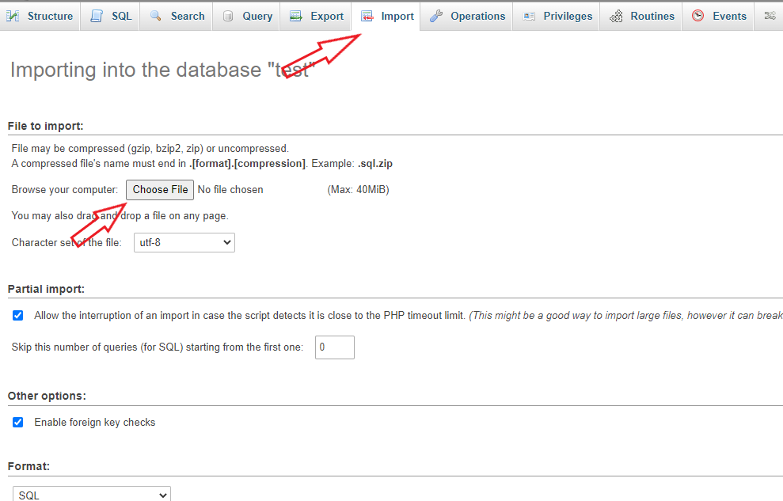

# [1] This is a blog written in mysql and nodejs express framework

a simple blog using nodejs express and mysql

## modified by [@mrCod3r](https://github.com/mrcod3r-ir)

## Requirements :

- Mysql database
- Nodejs

## Custom Versions ?

- [expressjs-sqlite-blog](https://github.com/JustPowerful/expressjs-sqlite-blog)

## How to use ?

- First you need to change the sql database informations in `/config/database.json`

- Change the session secret in `/config/session.json`

- Import the sql files from the `SQL` folder after creating a database
  OR Import just `test.db` from the `SQL` folder

- Now you can launch the `app.js` using node
